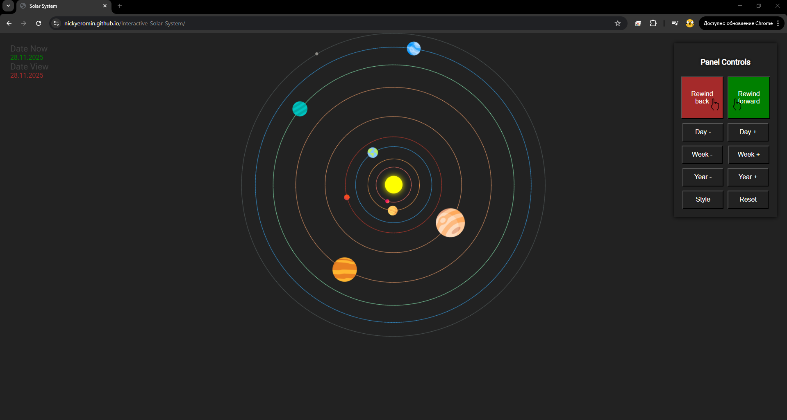

# 🌌Interactive-Solar-System
## 🚀About the Project
**Interactive-Solar-System** - This project creted in education porposes.👨‍🎓

You see dynamic solar system, wherein you can track possition planet relative to other object in solar system according to the indicated date on the table.
Complied with the ratio of **days in a year** for each planet.

| Planet  | Days per Orbit |
|---------|----------------|
| Mercury | 88             |
| Venus   | 225            |
| Earth   | 365            |
| Mars    | 687            |
| ...     | ...            |
|And so on... ... |

Possition planets does not depend on ephemerids. (meyby future update)🤫

## 🖥️ Demo

  
  
<a href='https://nickyeromin.github.io/Interactive-Solar-System/'>👉 Project here 👈</a>

  

## 📦 Technologies
- **HTML5** — render graphics
- **JavaScript** — logic rotate plannet in solar system
- **CSS3** — stage design
